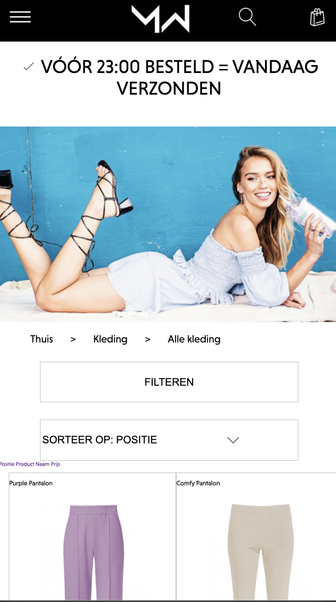
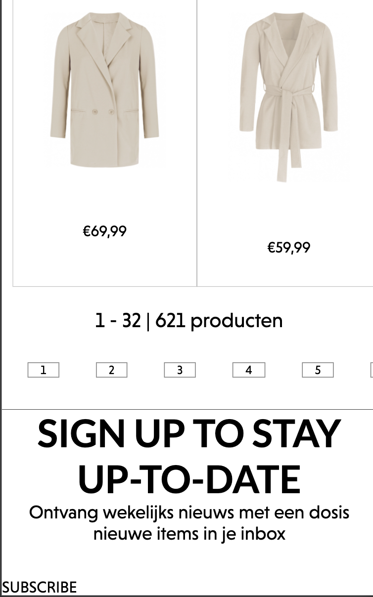
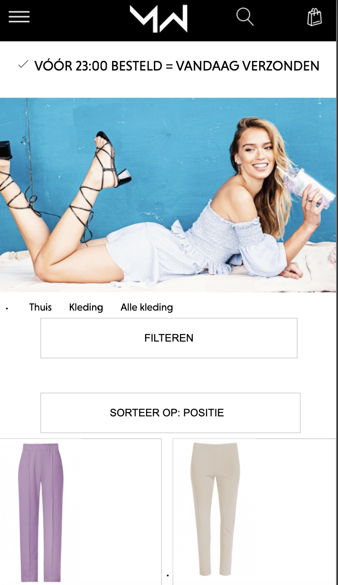
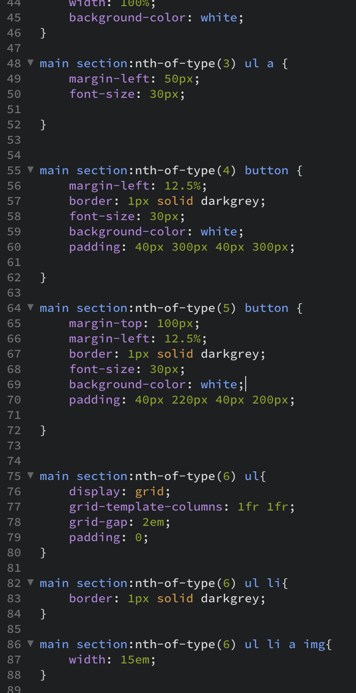
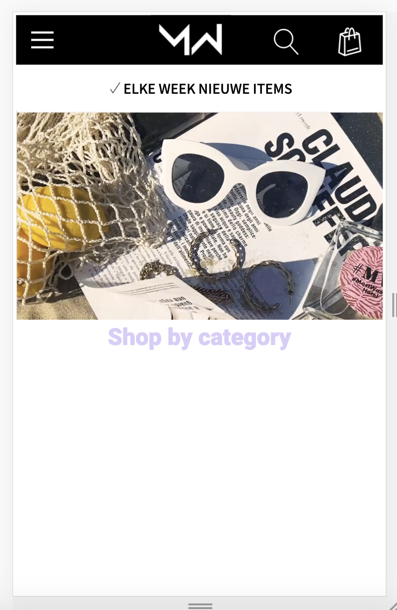

# Procesverslag
**Auteur:** Fleur van der Meer

Markdown cheat cheet: [Hulp bij het schrijven van Markdown](https://github.com/adam-p/markdown-here/wiki/Markdown-Cheatsheet). Nb. de standaardstructuur en de spartaanse opmaak zijn helemaal prima. Het gaat om de inhoud van je procesverslag. Besteedt de tijd voor pracht en praal aan je website.

## Bronnenlijst
1. -bron 1-
2. -bron 2-
3. -...-

## Eindgesprek (week 7/8)

-dit ging goed & dit was lastig-

**Screenshot(s):**

-screenshot(s) van je eindresultaat-

## Voortgang 3 (week 6)

## Stand van zaken
Deze week ging ik proberen om de JavaScript toe te voegen. Dit is helemaal niet gelukt. Ik snapte er niks van, heb rondgevraagd, maar ben er tot nu toe niet verder mee gekomen. 
Op dit moment ben ik bezig met de footer en deze week wil ik mijn eerst pagina af hebben. 

**Screenshot(s):**

Dit zijn twee afbeeldingen van mijn website tot nu toe.

### Agenda voor meeting
Ik zou het graag willen hebben over JavaScript, aangezien ik hier veel moeite mee heb. Ik moet een timer inbouwen, een dropdown en een soort van nieuwe pagina (ik weet niet hoe ik het moet noemen). Tijdens de les zal ik 1 van deze 3 stukken gaan vragen en hopelijk snap ik de andere drie dan ook beter, want ik hoop dat ik gewoon even opgefrist moet worden, maar zelf lukt het mij niet.

Wij hebben weer een volgorde bedacht zodat we per persoon vragen kunnen stellen. Wij hebben overeenkomende vragen, dus we kunnen ook van elkaars vragen leren. De volgorde is als volgt:
- Benthe
- Fleur 
- Denzel
- Arthur
- Jody

## Voortgang 2 (week 5)

### Stand van zaken
Deze week ben ik opnieuw begonnen met mijn code te schrijven. Bij mijn eerste voortgang liep ik er tegenaan dat mijn code er niet uit zag, ik gebruikte veel margin en padding en vooral geen flexbox. Ook gaf ik alles classes.
Op dit moment merk ik dat ik nog steeds redelijke aanpassingen maak in margin en padding. Dit zou ik graag willen veranderen, zodat mijn code er wat "cleaner" uit ziet. 
Ook zou ik graag gebruik willen maken van een grid. Ik heb dit geprobeerd op de manier dat ik dacht dat goed was, maar helaas werkt het niet. Daarnaast heb ik nog steeds wat moeite met positioneren.
Voor mijn volgende voortgang zou ik graag het grid toe hebben gepast en JavaScript voor 'filteren' en 'sorteren'.

**Screenshot(s):**

Op dit moment ziet mijn website er zo uit. Het is nog heel weinig, maar ik snap nu wel beter wat ik aan het doen ben. De vier kleine afbeeldingen aan de linkerkant zou ik graag willen positioneren door middel van een grid. 

Dit is een stukje van mijn CSS. In mijn oude versie, die ik nu niet meer heb, gebruikte ik alleen maar classes in plaats van 'first-of-type' en 'nth-of-type()', etc. Mijn code ziet er nu netter uit en daar ben ik persoonlijk blij(er) mee. 

### Agenda voor meeting
Wij hebben weer een volgorde bedacht zodat we per persoon vragen kunnen stellen. Wij hebben overeenkomende vragen, dus we kunnen ook van elkaars vragen leren. De volgorde is als volgt:
- Benthe
- Fleur 
- Denzel
- Arthur
- Jody

Graag willen wij het hebben over grid, positionering (flexbox v.s. grid) en (het bewerken van) forms.

### Verslag van meeting
Tijdens de meeting heb ik antwoord gekregen op een aantal vragen. Vanuit deze vragen zal ik verder werken, maar ik weet dat ik volgende week met JavaScript aan de gang moet gaan en ik weet dat ik hier heel veel moeite mee heb. 

## Voortgang 1 (week 3)

### Stand van zaken

Ik vind het lastig om nieuw geleerde stof meteen toe te passen. Hier liep ik tegenaan bij CSS en vooral bij flexbox, maar als ik meer oefen moet het lukken.

**Screenshot(s):**

 
### Agenda voor meeting

Wij hebben een volgorde vastgelegd van personen uit ons groepje die eerst gaan. Dan kan iedereen zijn vragen stellen en worden deze beantwoord zo krijgt iedereen feedback.
Volgorde:
- Benthe
- Fleur
- Denzel
- Arthur
- Jody

Mijn vraag zal gaan over css. Ik heb ook nog vragen over JavaScript, maar ik wil eerst dat de basis goed is. Mijn afbeeldingen staan nu namelijk het midden door middel van het aanpassen van de margin, maar (volgens mij) zou dit ook moet kunnen met flex-box.

### Verslag van meeting

Dit kan ik helaas niet invullen, omdat mijn laptop het niet meer deed.

## Intake (week 1)

**Je startniveau:** Mijn startniveau is de blauwe piste.

**Je focus:** Responsive

**Je opdracht:** https://www.mostwantednl.nl

**Screenshot(s):**

**Breakdown-schets(en):**

