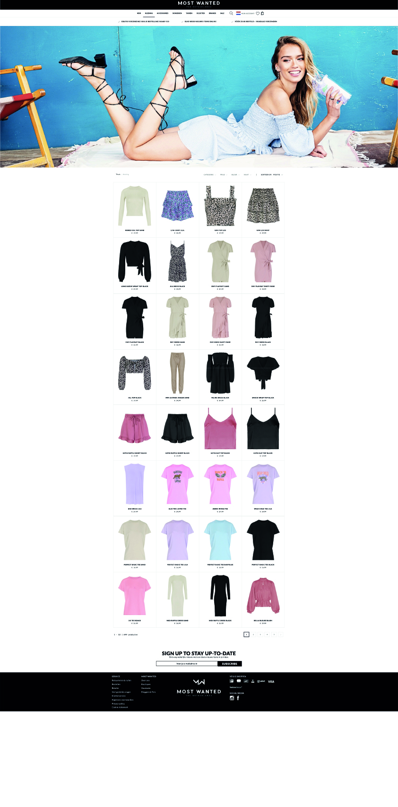
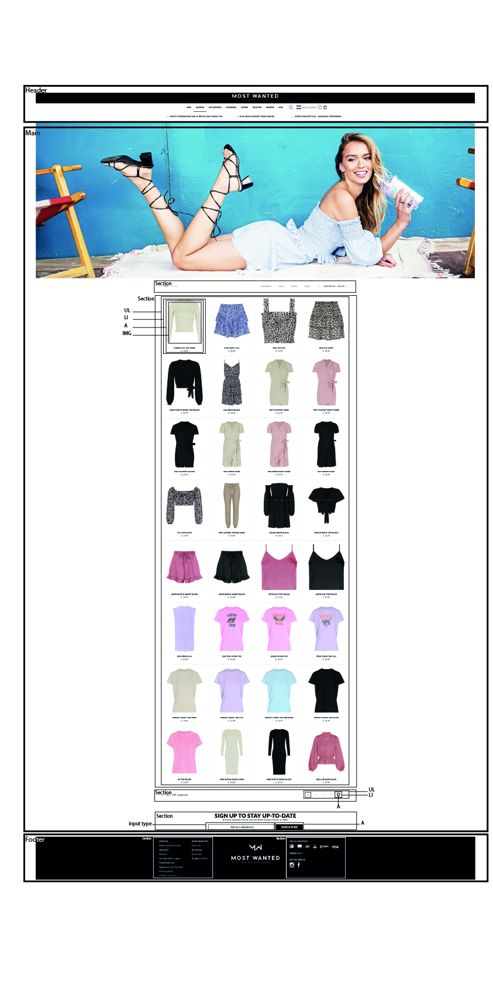

# Procesverslag
**Auteur:** Fleur van der Meer

Markdown cheat cheet: [Hulp bij het schrijven van Markdown](https://github.com/adam-p/markdown-here/wiki/Markdown-Cheatsheet). Nb. de standaardstructuur en de spartaanse opmaak zijn helemaal prima. Het gaat om de inhoud van je procesverslag. Besteedt de tijd voor pracht en praal aan je website.

## Bronnenlijst
1. -bron 1-
2. -bron 2-
3. -...-

## Eindgesprek (week 7/8)

-dit ging goed & dit was lastig-

**Screenshot(s):**

-screenshot(s) van je eindresultaat-

## Voortgang 3 (week 6)

-same as voortgang 1-

## Voortgang 2 (week 5)

-same as voortgang 1-

## Voortgang 1 (week 3)

### Stand van zaken

Ik vind het lastig om nieuw geleerde stof meteen toe te passen. Hier liep ik tegenaan bij CSS en vooral bij flexbox, maar als ik meer oefen moet het lukken.

**Screenshot(s):**
(images/voortgang1.png)
 
### Agenda voor meeting

Wij hebben een volgorde vastgelegd van personen uit ons groepje die eerst gaan. Dan kan iedereen zijn vragen stellen en worden deze beantwoord zo krijgt iedereen feedback.
Volgorde:
- Benthe
- Fleur
- Denzel
- Arthur
- Jody

### Verslag van meeting

-na afloop snel uitkomsten vastleggen-

## Intake (week 1)

**Je startniveau:** Mijn startniveau is de blauwe piste.

**Je focus:** Responsive

**Je opdracht:** https://www.mostwantednl.nl

**Screenshot(s):**

**Breakdown-schets(en):**

